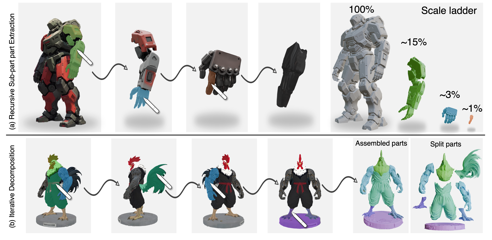

<div align="center">

# SAM3D-Part: Interactive Part Selection and Generation from 3D Objects

**SIGGRAPH Asia 2026**

Jiahao Chang<sup>1,2,3&#42;&dagger;</sup>&nbsp;&nbsp;
Dong Du<sup>4&dagger;</sup>&nbsp;&nbsp;
Wanhu Sun<sup>1</sup>&nbsp;&nbsp;
Yujian Zheng<sup>5</sup>&nbsp;&nbsp;
Chuanyu Pan<sup>3&Dagger;</sup><br>
Bowen Zhao<sup>3</sup>&nbsp;&nbsp;
Chongjie Ye<sup>1,2</sup>&nbsp;&nbsp;
Yuanming Hu<sup>3</sup>&nbsp;&nbsp;
Xiaoguang Han<sup>1,2,6&sect;</sup>

<sup>1</sup>SSE, CUHKSZ&nbsp;&nbsp;
<sup>2</sup>FNii-Shenzhen&nbsp;&nbsp;
<sup>3</sup>Meshy AI&nbsp;&nbsp;
<sup>4</sup>Nanjing University of Science and Technology<br>
<sup>5</sup>MBZUAI&nbsp;&nbsp;
<sup>6</sup>GenuX

<sub><sup>&#42;</sup>Work done during internship at Meshy AI.&nbsp;&nbsp;
<sup>&dagger;</sup>These authors contributed equally to this work.<br>
<sup>&Dagger;</sup>Project leader.&nbsp;&nbsp;
<sup>&sect;</sup>Corresponding authors.</sub>



</div>

Pick a part of a 3D object by clicking on a rendered view, and get that part
back as its own mesh, posed in the object's frame. This release contains
everything needed to run the gradio demo:

```
CUDA_VISIBLE_DEVICES=0 python app.py
```

The app: upload a mesh → adjust the viewpoint → click on the render to segment
a part (SAM) → *Generate 3D Part*. Stage-1 predicts the part's voxel occupancy
and pose, an internal SLat stage produces a coarse mesh, and (enabled via the
"TRELLIS.2 Refinement" panel) TRELLIS.2 regenerates it at high resolution.

## Layout

```
app.py                    the demo
sam3d_objects/            core pipeline package
wheels/TRELLIS            vendored TRELLIS (internal SLat stage utilities)
wheels/TRELLIS.2          vendored TRELLIS.2 (refinement)
wheels/Hunyuan3D-2.1      vendored hy3dshape (ShapeVAE code only)
notebook/, dataset.py, train_sam3d_part_ss.py   helpers imported by the app
checkpoints/, weights/    see "Weights" below
LICENSE, NOTICE.md, licenses/   licensing (read before redistributing)
install.sh                one-shot environment setup
requirements_reference.txt  pip freeze of the reference env (lookup only)
ENV_INFO.txt              python / torch / CUDA versions
```

## Environment

Reference: Python 3.11, PyTorch 2.6.0+cu124 (see `ENV_INFO.txt`), one GPU with
80 GB (H100/A100).

```bash
bash install.sh                  # create the conda env
conda activate sam3dpart
bash install.sh --skip-conda     # deps + build the CUDA extensions (20-40 min)
```

The script pins every package to the versions this release was verified with
and builds the CUDA extensions (`o_voxel`, `cumesh`, `flex_gemm`,
`nvdiffrast`, `cubvh`, `pytorch3d`, `gsplat`, `torch_cluster`) from their
upstream sources; it ends with an import self-check. `nvdiffrec` is built too
but treated as optional — only TRELLIS.2's PBR renderer uses it.

Prerequisites: conda, a CUDA toolkit whose `nvcc` matches the cu124 wheels,
git and a C++ compiler.

## Weights

Model configs (`*.yaml`) ship with the code; every binary is downloaded.

> **Do not overwrite the shipped `*.yaml` files.** Four of them
> (`pipeline.yaml`, `ss_generator.yaml`, `ss_encoder.yaml`,
> `slat_decoder_gs.yaml`) are modified versions that describe *our* models —
> replacing them with the originals from the SAM 3D Objects release will fail
> with shape mismatches.

### 1. Ours — from our HuggingFace repo (`bj6/sam3d-part`)

```bash
hf download bj6/sam3d-part --local-dir checkpoints
```

| file | size | role |
|---|---:|---|
| `checkpoints/stage1/sam3dpart_stage1_dit.ckpt` | 7.2 GB | stage-1 part sparse-structure DiT (+ condition embedders) |
| `checkpoints/vae/xyz_decoder.pt` | 458 MB | XYZ VAE decoder (occ-conditioned) — recovers the part's pose from its voxels |
| `checkpoints/vae/occ_encoder.pt` | 227 MB | occupancy encoder |
| `checkpoints/vae/xyz_encoder.pt` | 458 MB | optional — only for re-training / re-encoding latents |

### 2. SAM 3D Objects — from `facebook/sam-3d-objects` (license acceptance required)

Put these **five** binaries in `checkpoints/hf-download/checkpoints/`:

```
slat_generator.ckpt   ss_decoder.ckpt
slat_decoder_gs.ckpt   slat_decoder_gs_4.ckpt   slat_decoder_mesh.ckpt
```

Two files from that release are deliberately absent:

* `ss_encoder.pt` — that model is ours; it lives at
  `checkpoints/vae/occ_encoder.pt` (step 1).
* `ss_generator.ckpt` (6.3 GB) — the app never reads it, because our stage-1
  checkpoint overwrites every one of its parameters. Only needed if you run
  with `SKIP_UNUSED_WEIGHTS=0` (see "Weights actually loaded").

### 3. SAM ViT-H

```bash
wget -P weights/sam https://dl.fbaipublicfiles.com/segment_anything/sam_vit_h_4b8939.pth
```

### Auto-downloaded on first run (network / HF login required)

* `microsoft/TRELLIS.2-4B` — only the shape branch
  (`shape_slat_flow_model_512/1024`, `shape_slat_decoder`), ~5.9 GB
* `tencent/Hunyuan3D-2.1` ShapeVAE (cached under `~/.cache/hy3dgen/`)
* `facebookresearch/dinov2` via torch.hub, and the DINOv3 image encoder
  TRELLIS.2 conditions on

### Weights actually loaded

By default the app loads only what inference uses. It skips
`ss_generator.ckpt` (overwritten by our stage-1 weights), MoGe (the pointmap
is always rendered, never predicted), and TRELLIS.2's sparse-structure, PBR
texture and background-removal models — about 16 GB less to download and
load. A runtime assertion checks that our stage-1 checkpoint really does
cover every `ss_generator` parameter, so nothing can silently fall back to
random weights.

Set `SKIP_UNUSED_WEIGHTS=0` to load everything the original way — that mode
additionally needs `ss_generator.ckpt`, and it is the mode PBR texture baking
requires (the "Bake PBR Textures" checkbox is inert without it).

## License

This project redistributes third-party components under several licenses —
see **[NOTICE.md](NOTICE.md)** for the full mapping and your obligations.

The short version: `sam3d_objects/` is Meta's code and our stage-1 checkpoint
is a derivative work of SAM 3D Objects, both governed by the **SAM License**
(`licenses/SAM_LICENSE.txt`). If you redistribute this repository or anything
derived from it, you must do so under that same Agreement and include a copy
of it. Research published using these materials must acknowledge SAM
Materials. The vendored TRELLIS / TRELLIS.2 are MIT; the Hunyuan3D 2.1
ShapeVAE is under Tencent's Community License, which does not apply in the
EU, UK, or South Korea.

## Notes

* If huggingface.co is unreachable from your machine, `from_pretrained` can
  hang in connection retries even with a complete local cache. Once all hub
  models are cached, launch with `HF_HUB_OFFLINE=1 TRANSFORMERS_OFFLINE=1`
  (or set `HF_ENDPOINT` to a mirror for the first download).
* Training entry points (`train_sam3d_part_ss.py`, `dataset.py`) are included
  only because the app imports helper functions from them; their data paths
  point to internal storage and they are not runnable as released.

<!-- The paper is not public yet. Uncomment once it is, and check the
     booktitle against the official ACM proceedings name.

## Citation

```bibtex
@inproceedings{chang2026sam3dpart,
  title     = {SAM3D-Part: Interactive Part Selection and Generation from 3D Objects},
  author    = {Chang, Jiahao and Du, Dong and Sun, Wanhu and Zheng, Yujian and
               Pan, Chuanyu and Zhao, Bowen and Ye, Chongjie and Hu, Yuanming and
               Han, Xiaoguang},
  booktitle = {SIGGRAPH Asia 2026 Conference Papers},
  year      = {2026}
}
```
-->
